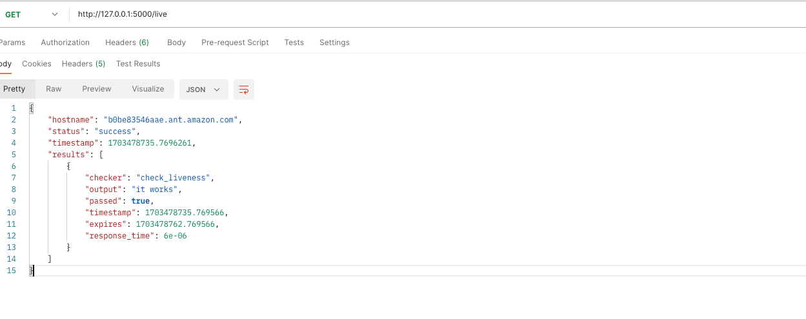

# Health Check
This is simple app to health check local server via Cron job or API.
# To setup:
 Setup <a href='https://docs.python-guide.org/starting/install3/linux/' target='_blank'> Python <a> 
 Setup <a href='https://docs.python-guide.org/starting/install3/linux/' target='_blank'> Python Env 

> git clone https://github.com/nguyendinhthi0705/health-check-agent.git  
> cd health-check-agent  
> python3 -m venv .venv  
> . .venv/bin/activate  
> pip install -r requirements.txt  

# To Start
## Update Configuration:
 Edit file .env for mysql connection, default CHECK_FREQUENCY is 1 or 1 minute
## Start Cron Job Check and Trigger Action Then Stop the App
To Add your own shell script action just update file actions.sh 

> python run_manual.py

## Start Web API
API will run with Flask

> flask run

## Start Cron Job

> python run_schedule.py